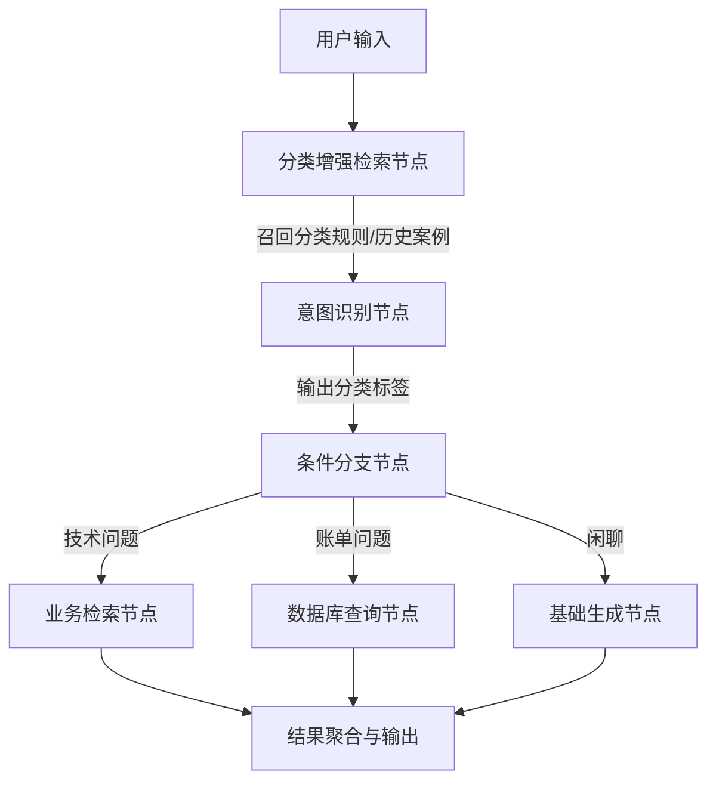
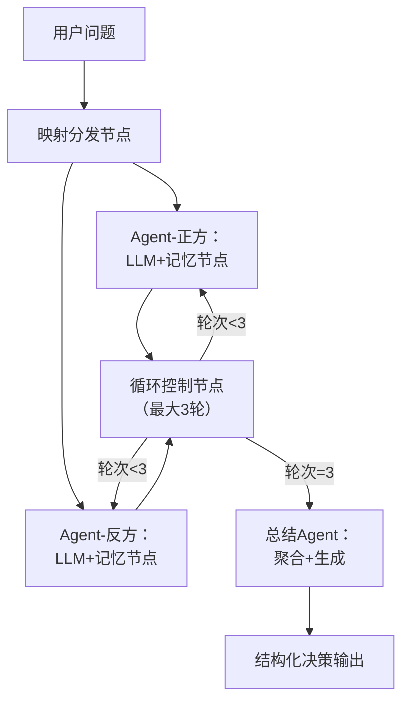
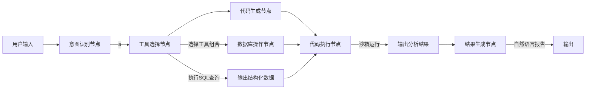
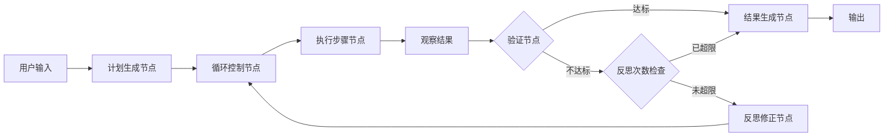

# 简介

我的[AI Agent架构选型](https://github.com/Eanrach/security_analysts_notes/blob/main/%E5%AE%89%E5%85%A8%E5%88%86%E6%9E%90%E6%80%9D%E8%B7%AF/AI%20Agent%E6%9E%B6%E6%9E%84%E9%80%89%E5%9E%8B.md)已经介绍了一些AI Agent设计架构，这篇文章将在[AI Agent架构选型](https://github.com/Eanrach/security_analysts_notes/blob/main/%E5%AE%89%E5%85%A8%E5%88%86%E6%9E%90%E6%80%9D%E8%B7%AF/AI%20Agent%E6%9E%B6%E6%9E%84%E9%80%89%E5%9E%8B.md)的基础上继续深化，节点组合将决定Agent的行为细节，我会列举和介绍一些AI Agent设计中常见的节点和组合方式，提供从架构到实现的关键衔接思路。本文意图抛砖引玉，欢迎讨论和补充。

# 节点类型

## 输入类（原始数据接入）

此层不涉及语义理解，仅做格式转换与数据接入

- 文本/结构化数据输入

- 文件解析（PDF/Word/Excel → 纯文本）

- 多模态输入（图像/音频 → 特征向量）

- 流式输入缓冲

## 认知类（语义理解与生成）

### 理解类

#### 意图识别节点

解析用户目标，如查询、闲聊

#### 实体抽取节点

识别关键参数，如时间、产品名、ID

  

### 检索增强类

#### 向量检索节点（Top-K召回）

基于语义相似度从大规模知识库中快速召回候选文档，将用户query进行向量标记后检索向量数据库

#### 重排序节点（Rerank精排）

对Top-K召回结果进行精细化相关性排序，提升关键信息的优先级，避免大语言模型过度依赖召回列表前几项

### 生成类

- 基础文本生成（含CoT思维链）

- 结构化输出生成（JSON Schema/Function Calling）

- 代码生成与解释

### 决策类

- 工具选择节点（基于意图选择API/数据库/搜索）

- 参数填充节点（从上下文提取工具参数）

## 工具执行类

- API请求节点

- 数据库操作节点（CRUD）

- 搜索引擎节点

- 文件读写节点

## 流程控制类（执行流编排）

- 条件分支节点

- 循环节点

- 并行分发节点（Map）与聚合节点（Reduce）

- 人工干预节点

## 记忆管理类

#### 短期记忆裁剪

动态维护对话上下文，控制输入长度以适配LLM上下文窗口

#### 长期记忆存取

持久化存储用户特征、偏好、历史行为，如提取用户画像写入向量数据库，对话时检索特征注入提示词。

#### 记忆反思节点

当对话轮次达阈值或会话结束时对对话历史进行压缩与提炼，将短期记忆转化为结构化长期记忆

## 输出行动节点

- 文本/结构化数据输出

- 文件生成与下载

- 流式输出控制

- 外部系统触发（Webhook/邮件）

# 常见工作流示例

## 问题分类器

## 辩论式决策生成

## 工具调用链

## 计划-执行-验证工作流

# 总结

本篇文章列举了常见的节点类型和一些工作流的组合方式，可以结合[AI Agent架构选型](https://github.com/Eanrach/security_analysts_notes/blob/main/%E5%AE%89%E5%85%A8%E5%88%86%E6%9E%90%E6%80%9D%E8%B7%AF/AI%20Agent%E6%9E%B6%E6%9E%84%E9%80%89%E5%9E%8B.md)提到的架构设计属于自己的LLM工具流以保证满足自己的需求，下篇文章将讨论提示词模板和构建。

Reference:

[AI Agent架构选型](https://github.com/Eanrach/security_analysts_notes/blob/main/%E5%AE%89%E5%85%A8%E5%88%86%E6%9E%90%E6%80%9D%E8%B7%AF/AI%20Agent%E6%9E%B6%E6%9E%84%E9%80%89%E5%9E%8B.md)

[Deb8flow: Orchestrating Autonomous AI Debates with LangGraph and GPT-4o \| Towards Data Science](https://towardsdatascience.com/deb8flow-orchestrating-autonomous-ai-debates-with-langgraph-and-gpt-4o/)

[Building an AI Debate Panel: Agents that Argue and Give a Final Conclusion](https://pub.towardsai.net/building-an-ai-debate-panel-agents-that-argue-and-give-a-final-conclusion-fb3fb3153f0c?gi=45b0d0fee09f&source=post_page---post_publication_info--a4a5c5c4f1ea---------------------------------------)

[Reflexion via LangGraph - The BioCypher Ecosystem](https://biocypher.org/BioChatter/features/reflexion-agent/)

[Eanrach/DifyToolsCollection](https://github.com/Eanrach/DifyToolsCollection)

[Eanrach/AIAgent_Repository](https://github.com/Eanrach/AIAgent_Repository)

